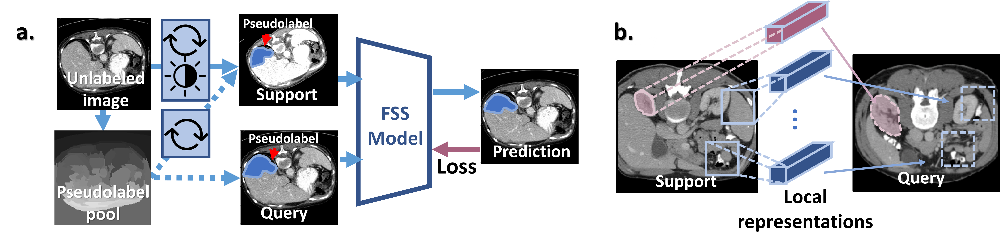

# SSL_ALPNet

[ECCV'20] [Self-supervision with Superpixels: Training Few-shot Medical Image Segmentation without Annotation](https://arxiv.org/abs/2007.09886v2)



**Abstract**:

Few-shot semantic segmentation (FSS) has great potential for medical imaging applications. Most of the existing FSS techniques require abundant annotated semantic classes for training. However, these methods may not be applicable for medical images due to the lack of annotations. To address this problem we make several contributions: (1) A novel self-supervised FSS framework for medical images in order to eliminate the requirement for annotations during training. Additionally, superpixel-based pseudo-labels are generated to provide supervision; (2) An adaptive local prototype pooling module plugged into prototypical networks, to solve the common challenging foreground-background imbalance problem in medical image segmentation; (3) We demonstrate the general applicability of the proposed approach for medical images using three different tasks: abdominal organ segmentation for CT and MRI, as well as cardiac segmentation for MRI. Our results show that, for medical image segmentation, the proposed method outperforms conventional FSS methods which require manual annotations for training.

**NOTE: We are actively updating this repository**

If you find this code base useful, please cite our paper. Thanks!

```
@article{ouyang2020self,
  title={Self-Supervision with Superpixels: Training Few-shot Medical Image Segmentation without Annotation},
  author={Ouyang, Cheng and Biffi, Carlo and Chen, Chen and Kart, Turkay and Qiu, Huaqi and Rueckert, Daniel},
  journal={arXiv preprint arXiv:2007.09886},
  year={2020}
}
```

### 1. Dependencies

Please install essential dependencies (see `requirements.txt`) 

```
dcm2nii
json5==0.8.5
jupyter==1.0.0
nibabel==2.5.1
numpy==1.15.1
opencv-python==4.1.1.26
Pillow==7.1.0 
sacred==0.7.5
scikit-image==0.14.0
SimpleITK==1.2.3
torch==1.3.0
torchvision==0.4.1
```

### 2. Data pre-processing 

**Abdominal MRI**

0. Download [Combined Healthy Abdominal Organ Segmentation dataset](https://chaos.grand-challenge.org/) and put the `/MR` folder under `./data/CHAOST2/` directory

1. Converting downloaded data (T2 fold) to `nii` files in 3D for the ease of reading

run `./data/CHAOST2/dcm_img_to_nii.sh` to convert dicom images to nifti files.

run `./data/CHAOST2/png_gth_to_nii.ipynp` to convert ground truth with `png` format to nifti.

2. Pre-processing downloaded images

run `./data/CHAOST2/image_normalize.ipynb`

**Abdominal CT**

0. Download [Synapse Multi-atlas Abdominal Segmentation dataset](https://www.synapse.org/#!Synapse:syn3193805/wiki/217789) and put the `/img` and `/label` folders under `./data/SABS/` directory

1. Intensity windowing 

run `./data/SABS/intensity_normalization.ipynb` to apply abdominal window.

2. Crop irrelavent emptry background and resample images

run `./data/SABS/resampling_and_roi.ipynb` 

**Shared steps**

3. Build class-slice indexing for setting up experiments

run `./data/<CHAOST2/SABS>class_slice_index_gen.ipynb`

```
You are highly welcomed to use this pre-processing pipeline in your own work for evaluating few-shot medical image segmentation in future. Please consider citing our paper (as well as the original sources of data) if you find this pipeline useful. Thanks! 
```

### 3. Pseudolabel generation

run `./data_preprocessing/pseudolabel_gen.ipynb`. You might need to specify which dataset to use within the notebook.

### 4. Running training and evaluation

run `./examples/train_ssl_abdominal_<mri/ct>.sh` and `./examples/test_ssl_abdominal_<mri/ct>.sh`

### Acknowledgement

This code is based on vanilla [PANet](https://github.com/kaixin96/PANet) (ICCV'19) by [Kaixin Wang](https://github.com/kaixin96) et al. The data augmentation tools are from Dr. [Jo Schlemper](https://github.com/js3611). Should you have any further questions, please [let us know](c.ouyang@imperial.ac.uk). Thanks again for your interest.

